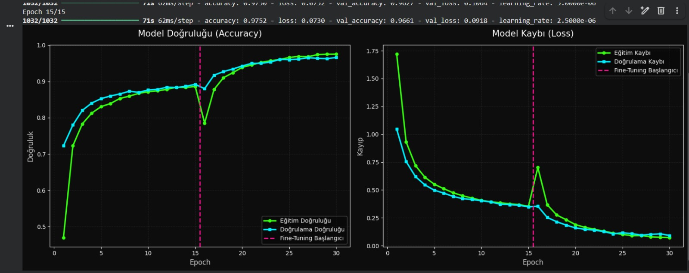
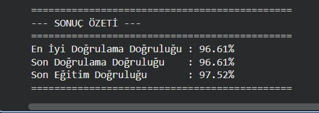

# 🌿 PlantVillage Yaprak Hastalığı Sınıflandırması | Transfer Learning + Fine-Tuning - 22370031011 Fikret Emre Sınmaz

Yaprak fotoğraflarından bitki türünü ve hastalık durumunu tahmin eden, **MobileNetV2** tabanlı bir derin öğrenme görüntü sınıflandırma projesidir. İki aşamalı eğitim stratejisi (Feature Extraction + Fine-Tuning) ile **%96.61 doğrulama doğruluğuna** ulaşılmıştır.

---

## İçindekiler

- [Sonuçlar](#-sonuçlar)
- [Proje Özeti](#-proje-özeti)
- [Transfer Learning & Fine-Tuning Mantığı](#-transfer-learning--fine-tuning-mantığı)
- [Veri Seti](#️-veri-seti-özellikleri)
- [Teknik Yapılandırma](#️-teknik-yapılandırma--donanım-metrikleri)
- [Aşırı Öğrenmeyi Önleyici Teknikler](#️-aşırı-öğrenmeyi-önleyici-teknikler)
- [Kurulum ve Çalıştırma](#-kurulum-ve-çalıştırma)
- [Gelecek Geliştirmeler](#-gelecek-geliştirmeler)

---

## 📊 Sonuçlar

İki aşamalı eğitim sonunda elde edilen doğruluk ve kayıp grafikleri:

Sonuç özeti:

| Metrik | Değer |
|--------|-------|
| **En İyi Doğrulama Doğruluğu** | %96.61 |
| **Son Doğrulama Doğruluğu** | %96.61 |
| **Son Eğitim Doğruluğu** | %97.52 |

> Grafikte pembe kesikli çizgi, **Fine-Tuning** aşamasının başladığı epoch'u gösterir. Bu noktada taban modelin katmanları çözüldüğü için doğrulukta geçici bir düşüş görülür; model kendini yeniden ayarladıktan sonra eski tavanını aşarak yükselir. Eğitim ve doğrulama çizgilerinin neredeyse üst üste olması, modelin **aşırı öğrenme (overfitting) yapmadığını** ve sağlıklı genellediğini gösterir.

---

## 📌 Proje Özeti

Bu proje, **Transfer Learning** ve **Fine-Tuning** yaklaşımlarını birleştirerek sınırlı GPU kaynaklarıyla (Google Colab T4) yüksek doğruluk oranına ulaşmayı hedefler. Sıfırdan model eğitmek yerine, milyonlarca görüntü üzerinde önceden eğitilmiş bir ağın öğrendiği genel özellikler (kenarlar, dokular, şekiller) tarım alanına uyarlanmıştır.

---

## 🧠 Transfer Learning & Fine-Tuning Mantığı

Eğitim, **iki aşamalı** olarak gerçekleştirilmiştir:

### Aşama 1 — Feature Extraction (Özellik Çıkarımı)

- **Önceden Eğitilmiş Taban:** ImageNet üzerinde eğitilmiş `MobileNetV2`, özellik çıkarıcı olarak kullanılır.
- **Ağırlıkların Dondurulması (`trainable = False`):** Tabanın öğrendiği genel görsel özellikler korunur; sadece üstteki yeni sınıflandırıcı katmanlar (`GlobalAveragePooling2D → Dropout → Dense`) eğitilir.

### Aşama 2 — Fine-Tuning (İnce Ayar)

- **Üst katmanların çözülmesi:** Taban modelin son katmanları (100. katmandan sonrası) eğitilebilir hale getirilir; ilk katmanlar donuk kalır.
- **Çok düşük öğrenme oranı (1e-5):** Önceden öğrenilmiş ağırlıkların bozulmaması için öğrenme oranı 10 kat düşürülür. Bu, modelin yaprak hastalıklarına özelleşmesini sağlar ve doğruluğu belirgin şekilde artırır.

---

## 🗂️ Veri Seti Özellikleri

| Özellik | Değer |
|---------|-------|
| **Kaynak** | Kaggle — `emmarex/plantdisease` |
| **Tip** | PlantVillage türevi |
| **Sınıf Yapısı** | Bitki türü + hastalık etiketi (dinamik tespit) |
| **Eğitim / Doğrulama Bölünmesi** | %80 / %20 |
| **Görüntü Boyutu** | 224 × 224 px |
| **Veri Çekme** | Kaggle API (ortam değişkeni ile) |

---

## ⚙️ Teknik Yapılandırma & Donanım Metrikleri

| Parametre | Değer |
|-----------|-------|
| **Ortam** | Google Colab |
| **Donanım** | NVIDIA Tesla T4 GPU |
| **Temel Model** | MobileNetV2 (ImageNet, `include_top=False`) |
| **Optimizer** | Adam |
| **Learning Rate — Aşama 1** | 0.0001 |
| **Learning Rate — Aşama 2** | 1e-5 |
| **Loss Fonksiyonu** | `sparse_categorical_crossentropy` |
| **Metrik** | Accuracy |
| **Batch Size** | 16 |
| **Toplam Epoch** | 30 (15 + 15, EarlyStopping ile kesilebilir) |
| **Veri Pipeline** | `tf.data` + `prefetch` |

---

## 🛡️ Aşırı Öğrenmeyi Önleyici Teknikler

- **Data Augmentation:** Rastgele yatay çevirme, ±%10 döndürme ve ±%10 zoom ile modelin genelleme gücü artırılmıştır.
- **Dropout (%20):** Sınıflandırıcı katmanda nöronların rastgele kapatılmasıyla ezberleme engellenir.
- **EarlyStopping:** Doğrulama doğruluğu artmayı bıraktığında eğitim otomatik durdurulur ve en iyi ağırlıklar geri yüklenir (`restore_best_weights=True`).
- **ReduceLROnPlateau:** Doğrulama kaybı iyileşmeyince öğrenme oranı otomatik olarak yarıya düşürülür.

---

## 🚀 Kurulum ve Çalıştırma

1. `derinogrenme.py` dosyasını Google Colab'a yükleyin.
2. **Runtime > Change runtime type > T4 GPU** seçin.
3. [Kaggle hesabınızdan](https://www.kaggle.com/settings) API token oluşturun ve telefon doğrulamasını tamamlayın.
4. Scriptteki `KAGGLE_USERNAME` ve `KAGGLE_KEY` alanlarını kendi bilgilerinizle doldurun.
5. Tüm hücreleri sırayla çalıştırın — veri indirme, ön işleme, iki aşamalı eğitim ve görselleştirme otomatik gerçekleşir.
6. Eğitim sonunda model `/content/model.keras` olarak kaydedilir.

---

## 📈 Gelecek Geliştirmeler

- **ResNet50 veya EfficientNet:** Daha büyük taban modellerle ek doğruluk denemesi.
- **Karışıklık Matrisi (Confusion Matrix):** Hangi sınıflarda hata yapıldığının analizi.
- **Daha agresif fine-tuning:** `FINE_TUNE_AT` değerini düşürerek daha fazla katmanı eğitime açmak.
- **Grad-CAM:** Modelin görselin hangi bölgesine odaklandığını görselleştirmek.

---

## 📄 Lisans

Eğitim amaçlı bir üniversite projesidir.
